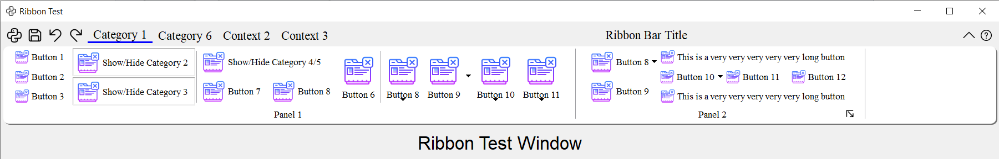

# PyQtRibbon

[](https://pyqribbon.readthedocs.io/en/stable/?badge=latest)
[](https://github.com/haiiliin/pyqtribbon/actions/workflows/tests.yml)
[](https://github.com/haiiliin/pyqtribbon/actions/workflows/publish.yml)
[](https://coveralls.io/github/haiiliin/pyqtribbon?branch=main)

[](https://github.com/haiiliin/pyqtribbon/blob/main/LICENSE)
[](https://www.python.org/)
[](https://pypi.org/project/pyqtribbon/)
[](https://pypi.org/project/pyqtribbon/)

Ribbon Bar for PyQt or PySide applications.

- GitHub Repository: [github.com/haiiliin/pyqtribbon](https://github.com/haiiliin/pyqtribbon/).
- Documentation: [pyqribbon.readthedocs.io/en/stable](https://pyqribbon.readthedocs.io/en/stable/).
- Python Package Index: [pypi.org/project/pyqtribbon](https://pypi.org/project/pyqtribbon/).
- Read the Docs: [readthedocs.org/projects/pyqribbon](https://readthedocs.org/projects/pyqribbon/).

## Installation

PyQtRibbon is distributed to [PyPI](https://pypi.org/project/pyqtribbon/), you can use pip to install it:

```shell
pip install pyqtribbon
```

You can also install the package from source:
```shell
pip install git+https://github.com/haiiliin/pyqtribbon.git@main
```

## Compatible Python and PyQt/PySide Versions

| [Python][py] | [PyQt5][PyQt5]      | [PyQt6][PyQt6]     | [PySide2][PySide2] | [PySide6][PySide6] |
|:------------:|:-------------------:|:------------------:|:------------------:|:------------------:|
|   3.8        | :white_check_mark:  | :white_check_mark: | :white_check_mark: | :white_check_mark: |
|   3.9        | :white_check_mark:  | :white_check_mark: | :white_check_mark: | :white_check_mark: |
|   3.10       | :white_check_mark:  | :white_check_mark: | :white_check_mark: | :white_check_mark: |
|   3.11       | :white_check_mark:  | :white_check_mark: |      :x: [^1]      | :white_check_mark: |
|   3.12       | :white_check_mark:  | :white_check_mark: |      :x: [^1]      | :white_check_mark: |

[py]: https://www.python.org/
[PyQt5]: https://pypi.org/project/PyQt5/
[PyQt6]: https://pypi.org/project/PyQt6/
[PySide2]: https://pypi.org/project/PySide2/
[PySide6]: https://pypi.org/project/PySide6/
[^1]: PySide2 does not support Python 3.11+ yet.

## The Ribbon Bar

The ribbon is first introduced by Microsoft in the 2000's. It is a toolbar with a tabbed interface. According to [Microsoft](https://docs.microsoft.com/en-us/cpp/mfc/ribbon-designer-mfc?view=msvc-170):

- A ribbon is a user interface (UI) element that organizes commands into logical groups. These groups appear on separate tabs in a strip across the top of the window. The ribbon replaces the menu bar and toolbars. A ribbon can significantly improve application usability. For more information, see Ribbons. The following illustration shows a ribbon. A ribbon can significantly improve application usability. For more information, see [Ribbons](https://docs.microsoft.com/en-us/windows/win32/uxguide/cmd-ribbons). The following illustration shows a ribbon.
  
  

## Definitions of Ribbon Elements

- **Application button**: The button that appears in the upper-left corner of a ribbon. The Application button replaces the File menu and is visible even when the ribbon is minimized. When the button is clicked, a menu that has a list of commands is displayed.

- **Quick Access toolbar**: A small, customizable toolbar that displays frequently used commands.

- **Category**: The logical grouping that represents the contents of a ribbon tab.

- **Category Default button**: The button that appears on the ribbon when the ribbon is minimized. When the button is clicked, the category reappears as a menu.

- **Panel**: An area of the ribbon bar that displays a group of related controls. Every ribbon category contains one or more ribbon panels.

- **Ribbon elements**: Controls in the panels, for example, buttons and combo boxes. To see the various controls that can be hosted on a ribbon, see RibbonGadgets Sample: Ribbon Gadgets Application.

## Screenshots


