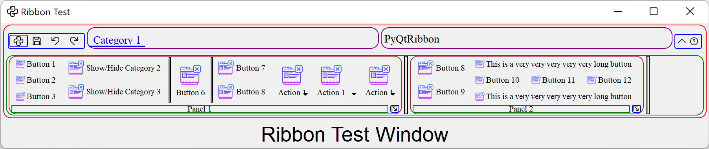

==============
The Ribbon Bar
==============

Introduction
------------

The ribbon is first introduced by Microsoft in the 2000's. It is a toolbar with a tabbed interface. According to `Microsoft <https://docs.microsoft.com/en-us/cpp/mfc/ribbon-designer-mfc?view=msvc-170>`_:

.. note::
    A ribbon is a user interface (UI) element that organizes commands into logical groups. These groups appear on separate tabs in a strip across the top of the window. The ribbon replaces the menu bar and toolbars. A ribbon can significantly improve application usability. For more information, see Ribbons. The following illustration shows a ribbon. A ribbon can significantly improve application usability. For more information, see `Ribbons <https://docs.microsoft.com/en-us/windows/win32/uxguide/cmd-ribbons>`_. The following illustration shows a ribbon.

    .. image:: _images/ribbon_no_callouts.png
        :align: center
        :width: 50%

Definitions of Ribbon Elements
------------------------------

.. image:: _images/ribbon.png
    :align: center
    :width: 50%

- **Application button**: The button that appears on the upper-left corner of a ribbon. The Application button replaces the File menu and is visible even when the ribbon is minimized. When the button is clicked, a menu that has a list of commands is displayed.

- **Quick Access toolbar**: A small, customizable toolbar that displays frequently used commands.

- **Category**: The logical grouping that represents the contents of a ribbon tab.

- **Category Default button**: The button that appears on the ribbon when the ribbon is minimized. When the button is clicked, the category reappears as a menu.

- **Panel**: An area of the ribbon bar that displays a group of related controls. Every ribbon category contains one or more ribbon panels.

- **Ribbon elements**: Controls in the panels, for example, buttons and combo boxes. To see the various controls that can be hosted on a ribbon, see RibbonGadgets Sample: Ribbon Gadgets Application.

Ribbon Elements in PyQtRibbon
-----------------------------

