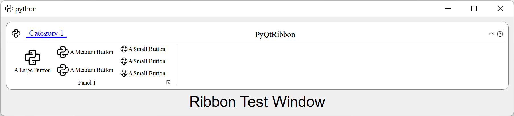

=========
Tutorials
=========

Using the RibbonBar
-------------------

:py:class:`~ribbon.ribbonbar.RibbonBar` is  a class that implements a ribbon bar, you can use it to create a ribbon bar.

.. literalinclude:: tutorial-ribbonbar.py
    :language: python

It would be rendered as follows:

Using the RibbonMainWindow
--------------------------

Alternatively, you can use the :py:class:`~ribbon.mainwindow.RibbonMainWindow` which is a QMainWindow that has a ribbon bar.

.. literalinclude:: tutorial-mainwindow.py
    :language: python
