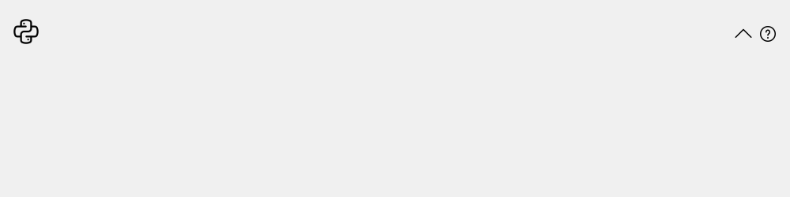
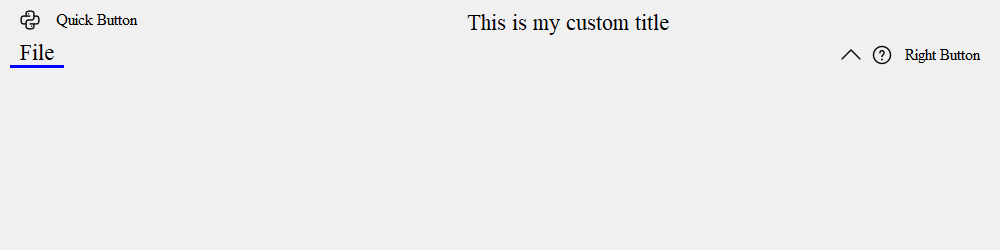
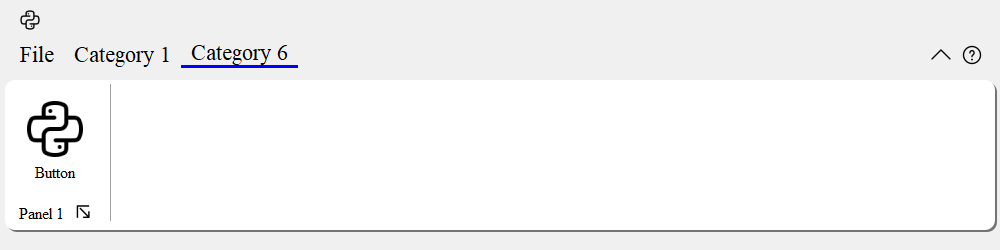
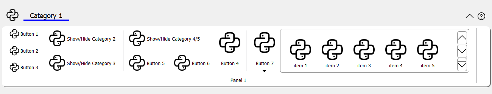
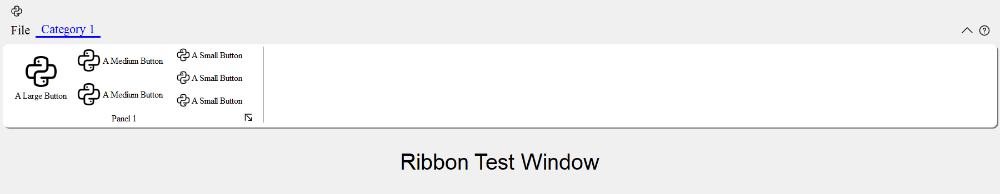

===========
User Manual
===========

The RibbonScreenShotWindow Class
--------------------------------

The :py:class:`~ribbon.screenshotwindow.RibbonScreenShotWindow` class is just for taking a screenshot of the window, 
the window will be closed 0.1s after it is shown. It is just used for documenting the window.

.. autoclass:: pyqtribbon.screenshotwindow.RibbonScreenShotWindow
    :members:
    :noindex:

Instantiate a Ribbon Bar
--------------------------

:py:class:`~ribbon.ribbonbar.RibbonBar` is inherited from :py:class:`~PyQt5.QtWidgets.QMenuBar`,
you can use the `setMenuBar` method of :py:class:`~PyQt5.QtWidgets.QMainWindow` to set the ribbon bar as the main menu bar. 

.. code-block:: python

    from pyqtribbon import RibbonBar

    window = QtWidgets.QMainWindow()
    ribbon = RibbonBar()
    window.setMenuBar(ribbon)

Example
~~~~~~~

For example, using the following code,

.. literalinclude:: _examples/ribbonbar.py

You can get a window like this:

Customize Ribbon Bar
--------------------

General Setups
~~~~~~~~~~~~~~

.. currentmodule:: pyqtribbon.ribbonbar

.. autosummary::

    RibbonBar.setRibbonStyle
    RibbonBar.ribbonHeight
    RibbonBar.setRibbonHeight
    RibbonBar.showRibbon
    RibbonBar.hideRibbon
    RibbonBar.ribbonVisible
    RibbonBar.setRibbonVisible

Setup Application Button
~~~~~~~~~~~~~~~~~~~~~~~~

.. currentmodule:: pyqtribbon.ribbonbar

.. autosummary::

    RibbonBar.applicationOptionButton
    RibbonBar.setApplicationIcon
    RibbonBar.addFileMenu

Setup Title
~~~~~~~~~~~

.. currentmodule:: pyqtribbon.ribbonbar

.. autosummary::

    RibbonBar.title
    RibbonBar.setTitle
    RibbonBar.addTitleWidget
    RibbonBar.insertTitleWidget
    RibbonBar.removeTitleWidget

Setup Category Tab Bar
~~~~~~~~~~~~~~~~~~~~~~

.. currentmodule:: pyqtribbon.ribbonbar

.. autosummary::

    RibbonBar.tabBar

Setup Quick Access Bar
~~~~~~~~~~~~~~~~~~~~~~

.. currentmodule:: pyqtribbon.ribbonbar

.. autosummary::

    RibbonBar.quickAccessToolBar
    RibbonBar.addQuickAccessButton
    RibbonBar.setQuickAccessButtonHeight

Setup Right Tool Bar
~~~~~~~~~~~~~~~~~~~~

.. currentmodule:: pyqtribbon.ribbonbar

.. autosummary::

    RibbonBar.rightToolBar
    RibbonBar.addRightToolButton
    RibbonBar.setRightToolBarHeight
    RibbonBar.setHelpButtonIcon
    RibbonBar.removeHelpButton
    RibbonBar.helpButtonClicked
    RibbonBar.collapseRibbonButton
    RibbonBar.setCollapseButtonIcon
    RibbonBar.removeCollapseButton

Example
~~~~~~~

For example, using the following code,

.. literalinclude:: _examples/ribbonbar-customize.py

You can get a window like this:

Manage Categories
~~~~~~~~~~~~~~~~~

.. currentmodule:: pyqtribbon.ribbonbar

.. autosummary::

    RibbonBar.categories
    RibbonBar.addCategory
    RibbonBar.addCategoriesBy
    RibbonBar.addNormalCategory
    RibbonBar.addContextCategory
    RibbonBar.addContextCategories
    RibbonBar.showContextCategory
    RibbonBar.hideContextCategory
    RibbonBar.removeCategory
    RibbonBar.setCurrentCategory
    RibbonBar.currentCategory
    RibbonBar.showCategoryByIndex

Customize Categories
--------------------

Setup Styles
~~~~~~~~~~~~

.. currentmodule:: pyqtribbon.category

.. autosummary::

    RibbonCategory.categoryStyle
    RibbonCategory.setCategoryStyle

Manage Panels
~~~~~~~~~~~~~

.. currentmodule:: pyqtribbon.category

.. autosummary::

    RibbonCategory.addPanel
    RibbonCategory.addPanelsBy
    RibbonCategory.removePanel
    RibbonCategory.takePanel
    RibbonCategory.panel
    RibbonCategory.panels

Example
~~~~~~~

For example, using the following code,

.. literalinclude:: _examples/category.py

You can get a window like this:

Customize Panels
----------------

Setup Title Label
~~~~~~~~~~~~~~~~~

.. currentmodule:: pyqtribbon.panel

.. autosummary::

    RibbonPanel.title
    RibbonPanel.setTitle

Setup Panel Option Button
~~~~~~~~~~~~~~~~~~~~~~~~~

.. currentmodule:: pyqtribbon.panel

.. autosummary::

    RibbonPanel.panelOptionButton
    RibbonPanel.setPanelOptionToolTip
    RibbonPanel.panelOptionClicked

Add Widgets to Panels
~~~~~~~~~~~~~~~~~~~~~

.. currentmodule:: pyqtribbon.panel

.. autosummary::

    RibbonPanel.addWidget
    RibbonPanel.addWidgetsBy
    RibbonPanel.removeWidget
    RibbonPanel.widget
    RibbonPanel.widgets
    RibbonPanel.addSmallWidget
    RibbonPanel.addMediumWidget
    RibbonPanel.addLargeWidget
    RibbonPanel.addButton
    RibbonPanel.addSmallButton
    RibbonPanel.addMediumButton
    RibbonPanel.addLargeButton
    RibbonPanel.addToggleButton
    RibbonPanel.addSmallToggleButton
    RibbonPanel.addMediumToggleButton
    RibbonPanel.addLargeToggleButton
    RibbonPanel.addComboBox
    RibbonPanel.addFontComboBox
    RibbonPanel.addLineEdit
    RibbonPanel.addTextEdit
    RibbonPanel.addPlainTextEdit
    RibbonPanel.addLabel
    RibbonPanel.addProgressBar
    RibbonPanel.addSlider
    RibbonPanel.addSpinBox
    RibbonPanel.addDoubleSpinBox
    RibbonPanel.addDateEdit
    RibbonPanel.addTimeEdit
    RibbonPanel.addDateTimeEdit
    RibbonPanel.addTableWidget
    RibbonPanel.addTreeWidget
    RibbonPanel.addListWidget
    RibbonPanel.addCalendarWidget
    RibbonPanel.addSeparator
    RibbonPanel.addHorizontalSeparator
    RibbonPanel.addVerticalSeparator
    RibbonPanel.addGallery

Example
~~~~~~~

For example, using the following code,

.. literalinclude:: _examples/panel.py

You can get a window like this:

A Complete Example
------------------

The following code snippet is a complete example.

.. literalinclude:: _examples/tutorial-ribbonbar.py

You can get a window like this:

